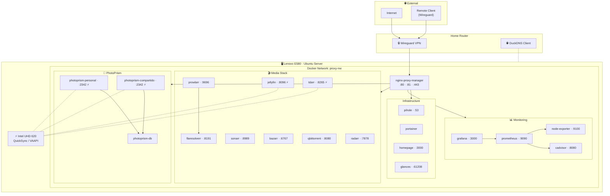

# 🏠 Casita Homelab

Personal homelab running on a **Lenovo ThinkPad E580** with Ubuntu Server.
All services are orchestrated with Docker Compose and are accessible **exclusively** through Nginx Proxy Manager via Wireguard.

> For detailed implementation rules and AI agent guide, see [`agents.md`](agents.md).

---

## Infrastructure Overview



> ⚡ = Intel QuickSync hardware acceleration enabled

---

## Project Structure

```text
homelab-e580/
├── docker-compose.yml           # Root orchestrator (uses 'include')
├── .env.template                # Environment variables template
├── .env                         # Real credentials (⚠️ DO NOT commit to Git)
├── .gitignore
├── agents.md                    # Full technical guide for AI agents and admins
├── README.md                    # This file
│
├── proxy/                       # 🔒 Nginx Proxy Manager + MariaDB
│   ├── docker-compose.yml
│   └── setup-npm-hosts.sh       # Script to configure proxy hosts and Pi-hole DNS via API
├── pihole/                      # 🛡️ DNS + Ad-blocker
│   └── docker-compose.yml
├── portainer/                   # 📦 Visual Docker management
│   └── docker-compose.yml
├── duckdns/                     # 🌐 Dynamic DNS (DDNS)
│   └── docker-compose.yml
├── arr/                         # 🎬 Radarr, Sonarr, Prowlarr, Bazarr, qBit, Jellyfin, FlareSolverr, Tdarr
│   ├── docker-compose.yml
│   └── TDARR_SETUP.md           # Post-deploy configuration guide for Tdarr
├── photoprism/                  # 📸 Photo gallery (personal + shared instances)
│   └── docker-compose.yml
├── monitoring/                  # 📊 Grafana, Prometheus, Node Exporter, cAdvisor
│   └── docker-compose.yml
├── homepage/                    # 🏠 Dashboard + Glances (system metrics)
│   ├── docker-compose.yml
│   └── config/                  # settings, services, widgets, docker, bookmarks
└── aidlc-docs/                  # 📋 AIDLC analysis artifacts
    └── inception/reverse-engineering/
```

---

## Active Services

| Service | Container | Host Port | Local Domain |
|---|---|---|---|
| Nginx Proxy Manager | `nginx-proxy-manager` | 80, 81, 443 | Homelab entry point |
| NPM Database | `npm-db` | — | Internal |
| Pi-hole | `pihole` | 53 (DNS) | `pihole.casita.local` |
| Portainer | `portainer` | — | `portainer.casita.local` |
| DuckDNS | `duckdns` | — | Background service (DDNS) |
| Radarr | `radarr` | — | `radarr.casita.local` |
| Sonarr | `sonarr` | — | `sonarr.casita.local` |
| Prowlarr | `prowlarr` | — | `prowlarr.casita.local` |
| Bazarr | `bazarr` | — | `bazarr.casita.local` |
| qBittorrent | `qbittorrent` | 6881 (torrents) | `qbit.casita.local` |
| Jellyfin | `jellyfin` | — | `jellyfin.casita.local` |
| FlareSolverr | `flaresolverr` | — | Internal (Prowlarr only) |
| Tdarr | `tdarr` | — | `tdarr.casita.local` |
| Homepage | `homepage` | — | `homepage.casita.local` |
| Glances | `glances` | — | `glances.casita.local` |
| PhotoPrism DB | `photoprism-db` | — | Internal |
| PhotoPrism Personal | `photoprism-personal` | — | `fotos.casita.local` |
| PhotoPrism Shared | `photoprism-compartido` | — | `familia.casita.local` |
| Grafana | `grafana` | — | `grafana.casita.local` |
| Prometheus | `prometheus` | — | Internal |
| Node Exporter | `node-exporter` | — | Internal |
| cAdvisor | `cadvisor` | — | Internal |

---

## Hardware Acceleration (GPU)

The server has an integrated Intel UHD 620 GPU. Hardware acceleration (Intel QuickSync / VAAPI) is configured via the `x-gpu-access` YAML anchor in the following services:

- **Jellyfin**: Real-time video transcoding.
- **PhotoPrism (both instances)**: Thumbnail generation and video indexing.
- **Tdarr**: Automated batch transcoding (re-encodes files >8 GB to H.264, HDR→SDR tone mapping).

---

## Quick Start

### 1. Configure environment variables

```bash
cp .env.template .env
nano .env   # Change ALL default passwords and set PIHOLE_HOST_IP
```

### 1b. Configure Homepage

```bash
cp homepage/config/services.yaml.template /home/casita/docker-data/homepage/config/services.yaml
nano /home/casita/docker-data/homepage/config/services.yaml  # Fill in API keys
```

> `services.yaml` contains API keys and is **not committed to Git** (same as `.env`). The template is included in the repo as a reference.

### 2. Create data directories on the server

```bash
sudo mkdir -p /home/casita/docker-data/{npm/{config,letsencrypt,mysql},pihole/{config,dnsmasq},portainer,duckdns/config}
sudo mkdir -p /home/casita/docker-data/arr/{radarr,sonarr,prowlarr,bazarr,qbittorrent,jellyfin,downloads}
sudo mkdir -p /home/casita/docker-data/arr/tdarr/{server,configs,logs,transcode-cache}
sudo mkdir -p /home/casita/docker-data/media/{movies,tv}
sudo mkdir -p /home/casita/docker-data/homepage/config
sudo mkdir -p /home/casita/docker-data/photoprism/{mysql,personal-storage,compartido-storage}
sudo mkdir -p /home/casita/docker-data/monitoring/{grafana,prometheus}
sudo chown -R 1000:1000 /home/casita/docker-data
```

### 3. Start the network and proxy first

The proxy must start first because it creates the `proxy-nw` network:

```bash
docker compose -f proxy/docker-compose.yml --env-file .env up -d
```

### 4. Start all remaining services

```bash
docker compose up -d
```

### 5. Configure Proxy Hosts in NPM and Pi-hole DNS (automated)

Once NPM and Pi-hole are running, execute the setup script:

```bash
# Install dependencies if not present
sudo apt install curl jq -y

# Grant permissions and run
chmod +x proxy/setup-npm-hosts.sh

# Run both NPM and Pi-hole setup (recommended)
./proxy/setup-npm-hosts.sh

# Or run individually:
./proxy/setup-npm-hosts.sh --npm-only   # NPM proxy hosts only
./proxy/setup-npm-hosts.sh --dns-only   # Pi-hole DNS entries only
```

> The script creates all Proxy Hosts and local DNS entries automatically.
> It is safe to run multiple times (detects and skips existing entries).

---

## System Data Migration (Docker / Containerd)

If the root partition (`/`) fills up due to images and containers, it is recommended to move the Docker and Containerd engines to a larger partition (e.g. `/home`).

**1. Move Docker Engine:**

```bash
sudo systemctl stop docker docker.socket containerd
sudo mkdir -p /home/casita/docker-engine
sudo rsync -aqxP /var/lib/docker/ /home/casita/docker-engine/
```

Edit `/etc/docker/daemon.json` and add `"data-root": "/home/casita/docker-engine"`.

**2. Move Containerd:**

```bash
sudo mkdir -p /home/casita/containerd-engine
sudo rsync -aqxP /var/lib/containerd/ /home/casita/containerd-engine/
```

Edit `/etc/containerd/config.toml` and set `root = "/home/casita/containerd-engine"`.

**3. Apply and Clean Up:**

```bash
sudo systemctl start containerd docker
# Verify with: docker info | grep "Docker Root Dir"
# If everything works, remove the old data:
sudo rm -rf /var/lib/docker/ /var/lib/containerd/
```

---

## Common Operations

```bash
# Check status of all containers
docker ps --format "table {{.Names}}\t{{.Status}}\t{{.Ports}}"

# Update a specific service
docker compose -f <service>/docker-compose.yml --env-file .env pull
docker compose -f <service>/docker-compose.yml --env-file .env up -d

# Update the entire lab
docker compose pull && docker compose up -d

# Follow logs in real time
docker logs -f <container-name>

# Stop a service without affecting others
docker compose -f <service>/docker-compose.yml --env-file .env down

# Clean up old images
docker image prune -f
```

---

## Security

- **Remote access**: Via Wireguard only (configured on the router).
- **Private services**: No web service exposes ports to the host except NPM (80, 81, 443).
- **Necessary exceptions**: Pi-hole (53/DNS) and qBittorrent (6881/torrents).
- **Credentials**: Stored in `.env`, protected by `.gitignore`. Never hardcoded in compose files.
- **Internal network**: All services communicate through the Docker `proxy-nw` network, invisible from outside.

---

## Planned Services

| Service | Purpose |
|---|---|
| [n8n](https://n8n.io) | Workflow automation and self-hosted Zapier alternative |
| [Wazuh](https://wazuh.com) | Security monitoring, SIEM, and intrusion detection |

---

## Homepage API Keys

The real keys file lives on the host (outside the repo):

```bash
# First time — copy the template
cp homepage/config/services.yaml.template /home/casita/docker-data/homepage/config/services.yaml

# Edit and fill in each <SERVICE_API_KEY>
nano /home/casita/docker-data/homepage/config/services.yaml
```

| Service | Where to find the key |
|---|---|
| Pi-hole | Settings > API / Web interface > Show API Key |
| Jellyfin | Dashboard > API Keys > New key |
| Portainer | Account > Access Tokens > Add access token |
| Radarr | Settings > General > API Key |
| Sonarr | Settings > General > API Key |
| Prowlarr | Settings > General > API Key |
| Bazarr | Settings > General > API Key |
| qBittorrent | Web panel credentials |

---

## Contact

Made with ☕ by **Salvador Campanella** — Cloud Engineer & SRE.

- 🌐 Website: [salvadorcampanella.com](https://salvadorcampanella.com)
- 📧 Email: [contact@salvadorcampanella.com](mailto:contact@salvadorcampanella.com)

Feel free to reach out for questions, suggestions, or just to say hi!
