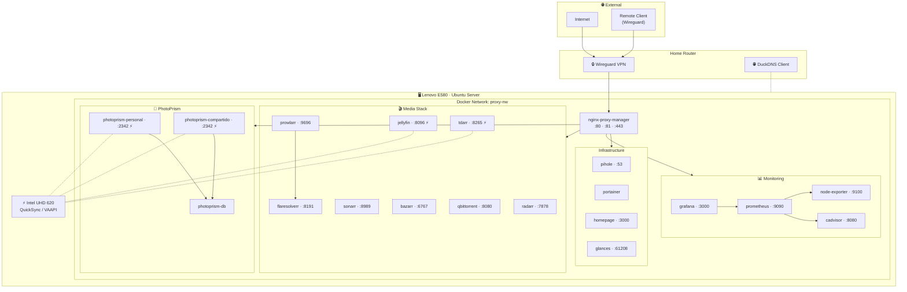

# 🏠 Casita Homelab

Personal homelab running on a **Lenovo ThinkPad E580** with Ubuntu Server.
All services are orchestrated with Docker Compose and are accessible **exclusively** through Nginx Proxy Manager via Wireguard.

> For detailed implementation rules and AI agent guide, see [`agents.md`](agents.md).

---

## Infrastructure Overview



---

## Environment Setup (`.env`)

Copy `.env.template` to `.env` and fill in your environment variables:

```bash
cp .env.template .env
```

### Key Environment Variables & Credentials:

| Variable | Description | How to obtain |
|---|---|---|
| `BASE_DOMAIN` | Your primary domain | Purchase domain (e.g. Cloudflare DNS) |
| `CLOUDFLARE_API_TOKEN` | Cloudflare DNS edit token | Cloudflare > My Profile > API Tokens > Create Token (DNS Edit) |
| `DUCKDNS_TOKEN` | Dynamic DNS token | DuckDNS.org Account panel |
| `TELEGRAM_BOT_TOKEN` | Telegram Bot Token | Telegram `@BotFather` > `/newbot` |
| `GEMINI_API_KEY` | Google Gemini API Key | Google AI Studio > Create API Key |
| `PAYROLL_SPREADSHEET_ID` | Google Sheets ID | Extract from Sheets URL: `https://docs.google.com/spreadsheets/d/<ID>/edit` |
| `PAYROLL_DRIVE_FOLDER_ID` | Google Drive Folder ID | Extract from Drive URL: `https://drive.google.com/drive/folders/<ID>` |

---

## Project Structure

```text
homelab-e580/
├── docker-compose.yml           # Root orchestrator (uses 'include')
├── .env.template                # Environment variables template
├── .env                         # Real credentials (⚠️ DO NOT commit to Git)
├── .gitignore
├── agents.md                    # Full technical guide for AI agents and admins
├── README.md                    # This file
│
├── proxy/                       # 🔒 Nginx Proxy Manager + MariaDB
│   ├── docker-compose.yml
│   └── setup-npm-hosts.sh       # Script to configure proxy hosts and Pi-hole DNS via API
├── pihole/                      # 🛡️ DNS + Ad-blocker
│   └── docker-compose.yml
├── portainer/                   # 📦 Visual Docker management
│   └── docker-compose.yml
├── duckdns/                     # 🌐 Dynamic DNS (DDNS)
│   └── docker-compose.yml
├── arr/                         # 🎬 Radarr, Sonarr, Prowlarr, Bazarr, qBit, Jellyfin, FlareSolverr, Tdarr
│   ├── docker-compose.yml
│   └── TDARR_SETUP.md           # Post-deploy configuration guide for Tdarr
├── photoprism/                  # 📸 Photo gallery (personal + shared instances)
│   └── docker-compose.yml
├── monitoring/                  # 📊 Grafana, Prometheus, Node Exporter, cAdvisor
│   ├── docker-compose.yml
│   └── dashboards/              # 📈 Pre-configured SRE Grafana Dashboards (JSON)
├── homepage/                    # 🏠 Dashboard + Glances (system metrics)
│   ├── docker-compose.yml
│   └── config/                  # settings, services, widgets, docker, bookmarks
├── n8n/                         # ⚡ Workflow automation platform
│   └── docker-compose.yml
└── aidlc-docs/                  # 📋 AIDLC analysis artifacts
    └── inception/reverse-engineering/
```

---

## Active Services

| Service | Container | Host Port | Primary HTTPS Domain | Local 301 Redirection Domain |
|---|---|---|---|---|
| Nginx Proxy Manager | `nginx-proxy-manager` | 80, 81, 443 | `https://npm.salvador512.com` | `http://npm.casita.local` |
| NPM Database | `npm-db` | — | Internal | Internal |
| Pi-hole | `pihole` | 53 (DNS) | `https://pihole.salvador512.com` | `http://pihole.casita.local` |
| Portainer | `portainer` | — | `https://portainer.salvador512.com` | `http://portainer.casita.local` |
| DuckDNS | `duckdns` | — | Background service (DDNS) | Background service (DDNS) |
| Radarr | `radarr` | — | `https://radarr.salvador512.com` | `http://radarr.casita.local` |
| Sonarr | `sonarr` | — | `https://sonarr.salvador512.com` | `http://sonarr.casita.local` |
| Prowlarr | `prowlarr` | — | `https://prowlarr.salvador512.com` | `http://prowlarr.casita.local` |
| Bazarr | `bazarr` | — | `https://bazarr.salvador512.com` | `http://bazarr.casita.local` |
| qBittorrent | `qbittorrent` | 6881 (torrents) | `https://qbit.salvador512.com` | `http://qbit.casita.local` |
| Jellyfin | `jellyfin` | — | `https://jellyfin.salvador512.com` | `http://jellyfin.casita.local` |
| FlareSolverr | `flaresolverr` | — | Internal (Prowlarr only) | Internal (Prowlarr only) |
| Tdarr | `tdarr` | — | `https://tdarr.salvador512.com` | `http://tdarr.casita.local` |
| Homepage | `homepage` | — | `https://homepage.salvador512.com` | `http://homepage.casita.local` |
| Glances | `glances` | — | `https://glances.salvador512.com` | `http://glances.casita.local` |
| PhotoPrism DB | `photoprism-db` | — | Internal | Internal |
| PhotoPrism Personal | `photoprism-personal` | — | `https://fotos.salvador512.com` | `http://fotos.casita.local` |
| PhotoPrism Shared | `photoprism-compartido` | — | `https://familia.salvador512.com` | `http://familia.casita.local` |
| Grafana | `grafana` | — | `https://grafana.salvador512.com` | `http://grafana.casita.local` |
| Prometheus | `prometheus` | — | Internal | Internal |
| Node Exporter | `node-exporter` | — | Internal | Internal |
| cAdvisor | `cadvisor` | — | Internal | Internal |
| n8n | `n8n` | — | `https://n8n.salvador512.com` | `http://n8n.casita.local` |

---

## Monitoring & SRE Dashboards

The homelab includes two production-grade, pre-configured Grafana SRE Dashboards located in [`monitoring/dashboards/`](monitoring/dashboards/):

1. **[🖥️ Host & Hardware Monitoring](monitoring/dashboards/host_hardware_monitoring.json)** (`UID: homelab-host`):
   - **Host System Overview**: System Uptime, CPU Load (1m), RAM Usage, Swap Usage, Disk Used (LCD), Inode Usage (LCD), CPU Mode Breakdown, per-vCPU usage, CPU Core Temperatures (°C), and Host Network Traffic (+Rx / -Tx mirrored).
   - **Storage & Disk Performance**: Triple-partition breakdown (`/dev/sda1` root `/`, `/dev/sda3` `/home`, and `/dev/sdd1` `/mnt/ev_deluxe`) covering 100% Stacked Disk Space, Throughput (Read/Write Bps), IOPS, and I/O Utilization % (Disk Busy).
2. **[🐳 Docker & Containers Monitoring](monitoring/dashboards/docker_containers_monitoring.json)** (`UID: homelab-docker`):
   - **Container Metrics & Rankings**: Running containers, Container Restart tracking, Top 5 Rankings (CPU %, RAM Working Set, Network Traffic), and per-container real-time metrics with dynamic `$container` dropdown filter.
   - **Cross-dashboard navigation**: Built-in header links to switch between Host and Docker views instantly.

### Automated Telegram Alerting (10 SRE Rules):
The homelab includes 10 production-grade alert rules declaratively defined in [`monitoring/alerting/homelab_alerts.json`](monitoring/alerting/homelab_alerts.json), all routed directly to your Telegram bot via the `Telegram-Alerts` contact point:

| Category | Alert Rule | Threshold / Condition | Severity |
|---|---|---|---|
| **Storage** | **Disk Space Warning** | Any disk (`/`, `/home`, `/mnt/ev_deluxe`) > 85% for 5m | `warning` |
| **Storage** | **Disk Space Critical** | Any disk > 95% for 2m | `critical` |
| **Storage** | **Disk Inodes Exhaustion** | Inode usage > 85% for 5m | `warning` |
| **Storage** | **Disk I/O Saturation** | Disk active time (`sda`, `sdd`) > 90% for 10m | `warning` |
| **Host** | **Host RAM High Usage** | Host RAM utilization > 90% for 5m (prevents OOM-killer) | `warning` |
| **Host** | **Host Swap Exhaustion** | Swap utilization > 80% for 5m (prevents system freeze) | `critical` |
| **Host** | **Host CPU High Temperature** | Laptop CPU package temp > 80°C for 3m (prevents throttling) | `warning` |
| **Host** | **Host CPU Load Overload** | 1-minute load average > 6.0 for 10m | `warning` |
| **Containers** | **Container CrashLooping** | Container restarts > 3 times in 15m | `critical` |
| **Containers** | **Core Service Down** | Core container (NPM, Pi-hole, Grafana, Radarr, Sonarr, Jellyfin) down > 60s | `critical` |

### How to Provision / Sync Dashboards & Alerts:
Run the unified automation script (reads credentials directly from `.env` and detects Grafana IP dynamically):
```bash
python3 monitoring/upload_dashboards.py
```
This single command provisions both dashboards, creates all 10 alert rules, and configures Telegram as the default notification policy.

---

## Hardware Acceleration (GPU)

The server has an integrated Intel UHD 620 GPU. Hardware acceleration (Intel QuickSync / VAAPI) is configured via the `x-gpu-access` YAML anchor in the following services:

- **Jellyfin**: Real-time video transcoding.
- **PhotoPrism (both instances)**: Thumbnail generation and video indexing.
- **Tdarr**: Automated batch transcoding (re-encodes files >8 GB to H.264, HDR→SDR tone mapping).

---

## Quick Start

### 1. Configure environment variables

```bash
cp .env.template .env
nano .env   # Change ALL default passwords and set PIHOLE_HOST_IP
```

### 1b. Configure Homepage

```bash
cp homepage/config/services.yaml.template /home/casita/docker-data/homepage/config/services.yaml
nano /home/casita/docker-data/homepage/config/services.yaml  # Fill in API keys
```

> `services.yaml` contains API keys and is **not committed to Git** (same as `.env`). The template is included in the repo as a reference.

### 2. Create data directories on the server

```bash
sudo mkdir -p /home/casita/docker-data/{npm/{config,letsencrypt,mysql},pihole/{config,dnsmasq},portainer,duckdns/config}
sudo mkdir -p /home/casita/docker-data/arr/{radarr,sonarr,prowlarr,bazarr,qbittorrent,jellyfin,downloads}
sudo mkdir -p /home/casita/docker-data/arr/tdarr/{server,configs,logs,transcode-cache}
sudo mkdir -p /home/casita/docker-data/media/{movies,tv}
sudo mkdir -p /home/casita/docker-data/homepage/config
sudo mkdir -p /home/casita/docker-data/photoprism/{mysql,personal-storage,compartido-storage}
sudo mkdir -p /home/casita/docker-data/monitoring/{grafana,prometheus}
sudo chown -R 1000:1000 /home/casita/docker-data
```

### 3. Start the network and proxy first

The proxy must start first because it creates the `proxy-nw` network:

```bash
docker compose -f proxy/docker-compose.yml --env-file .env up -d
```

### 4. Start all remaining services

```bash
docker compose up -d
```

### 5. Configure Proxy Hosts in NPM and Pi-hole DNS (automated)

Once NPM and Pi-hole are running, execute the setup script:

```bash
# Install dependencies if not present
sudo apt install curl jq -y

# Grant permissions and run
chmod +x proxy/setup-npm-hosts.sh

# Run both NPM and Pi-hole setup (recommended)
./proxy/setup-npm-hosts.sh

# Or run individually:
./proxy/setup-npm-hosts.sh --npm-only   # NPM proxy hosts only
./proxy/setup-npm-hosts.sh --dns-only   # Pi-hole DNS entries only
```

> The script creates all Proxy Hosts and local DNS entries automatically.
> It is safe to run multiple times (detects and skips existing entries).

---

## System Data Migration (Docker / Containerd)

If the root partition (`/`) fills up due to images and containers, it is recommended to move the Docker and Containerd engines to a larger partition (e.g. `/home`).

**1. Move Docker Engine:**

```bash
sudo systemctl stop docker docker.socket containerd
sudo mkdir -p /home/casita/docker-engine
sudo rsync -aqxP /var/lib/docker/ /home/casita/docker-engine/
```

Edit `/etc/docker/daemon.json` and add `"data-root": "/home/casita/docker-engine"`.

**2. Move Containerd:**

```bash
sudo mkdir -p /home/casita/containerd-engine
sudo rsync -aqxP /var/lib/containerd/ /home/casita/containerd-engine/
```

Edit `/etc/containerd/config.toml` and set `root = "/home/casita/containerd-engine"`.

**3. Apply and Clean Up:**

```bash
sudo systemctl start containerd docker
# Verify with: docker info | grep "Docker Root Dir"
# If everything works, remove the old data:
sudo rm -rf /var/lib/docker/ /var/lib/containerd/
```

---

## Common Operations

```bash
# Check status of all containers
docker ps --format "table {{.Names}}\t{{.Status}}\t{{.Ports}}"

# Update a specific service
docker compose -f <service>/docker-compose.yml --env-file .env pull
docker compose -f <service>/docker-compose.yml --env-file .env up -d

# Update the entire lab
docker compose pull && docker compose up -d

# Follow logs in real time
docker logs -f <container-name>

# Stop a service without affecting others
docker compose -f <service>/docker-compose.yml --env-file .env down

# Clean up old images
docker image prune -f
```

---

## Security

- **Remote access**: Via Wireguard only (configured on the router).
- **Private services**: No web service exposes ports to the host except NPM (80, 81, 443).
- **Necessary exceptions**: Pi-hole (53/DNS) and qBittorrent (6881/torrents).
- **Credentials**: Stored in `.env`, protected by `.gitignore`. Never hardcoded in compose files.
- **Internal network**: All services communicate through the Docker `proxy-nw` network, invisible from outside.

---

## Planned Services

| Service | Purpose |
|---|---|
| [n8n](https://n8n.io) | Workflow automation and self-hosted Zapier alternative |
| [Wazuh](https://wazuh.com) | Security monitoring, SIEM, and intrusion detection |

---

## Homepage API Keys

The real keys file lives on the host (outside the repo):

```bash
# First time — copy the template
cp homepage/config/services.yaml.template /home/casita/docker-data/homepage/config/services.yaml

# Edit and fill in each <SERVICE_API_KEY>
nano /home/casita/docker-data/homepage/config/services.yaml
```

| Service | Where to find the key |
|---|---|
| Pi-hole | Settings > API / Web interface > Show API Key |
| Jellyfin | Dashboard > API Keys > New key |
| Portainer | Account > Access Tokens > Add access token |
| Radarr | Settings > General > API Key |
| Sonarr | Settings > General > API Key |
| Prowlarr | Settings > General > API Key |
| Bazarr | Settings > General > API Key |
| qBittorrent | Web panel credentials |

---

## Contact

Made with ☕ by **Salvador Campanella** — Cloud Engineer & SRE.

- 🌐 Website: [salvadorcampanella.com](https://salvadorcampanella.com)
- 📧 Email: [contact@salvadorcampanella.com](mailto:contact@salvadorcampanella.com)

Feel free to reach out for questions, suggestions, or just to say hi!
